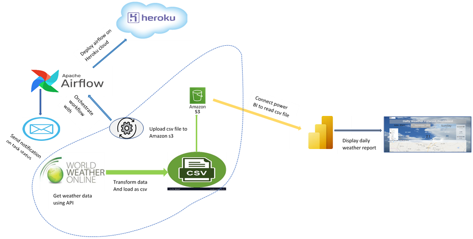

# daily-weather-forecast-board
Extracts daily Nigeria weather forecast from WorldWeather API and display on a dashboard. The steps inlude\

* Extraction of data from API
* Transform and Load data into data stroage (s3 bucket)
* ochestration of ETL process and work flow monitoring using airflow
* Send notification for state execution 
* Read data from data storage using power BI and build a weather dash board
* Publish dashboard to Power BI serice

✔ Requests \
✔ json \
✔ Pandas \
✔ AWS s3 \
✔ boto3 \
✔ Apache-airflow \
✔ Microsoft Power BI \
✔ Pydantic
✔

> The work flow diagram is below
    
